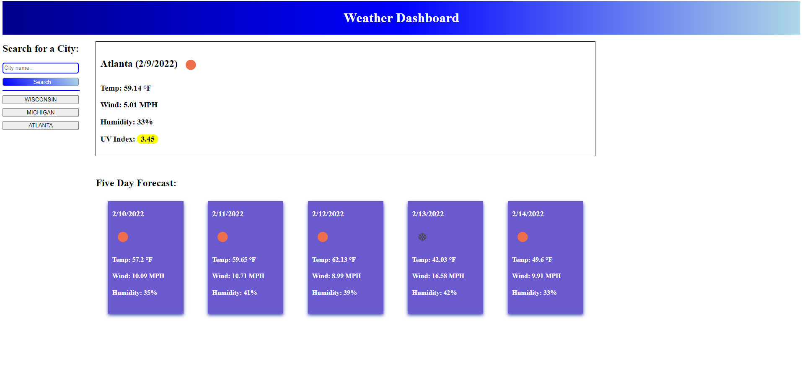

## Weather Dashboard
A simple web app that fetches third-party API's to generate weather data for any city. It has an intuitive UI 
and uses jQuery for dynamic page elements.

## Technologies Used
[OpenWeather API](https://openweathermap.org/) – to find weather conditions

[Moment.js](https://momentjs.com/) -- to format dates

[Local Storage](https://developer.mozilla.org/en-US/docs/Web/API/Window/localStorage) - to store persistent data

## Screenshot

## Page Link
[Weather Dashboard](https://yellowyam.github.io/weather-dashboard/)

## License

